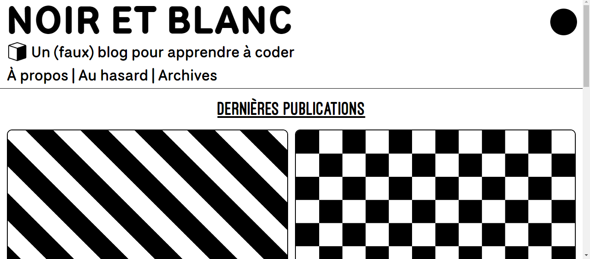
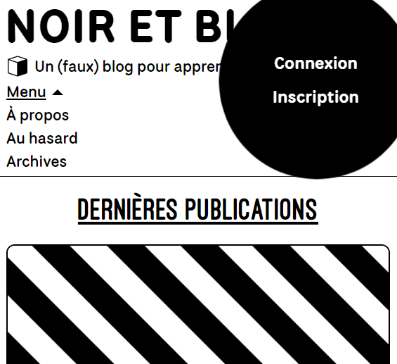
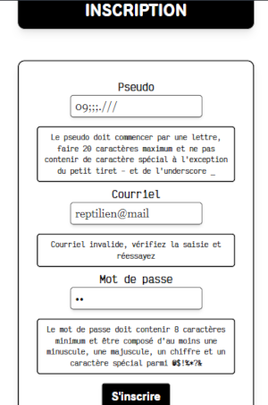
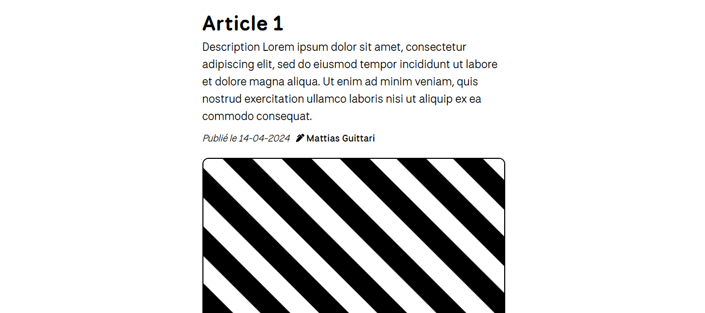
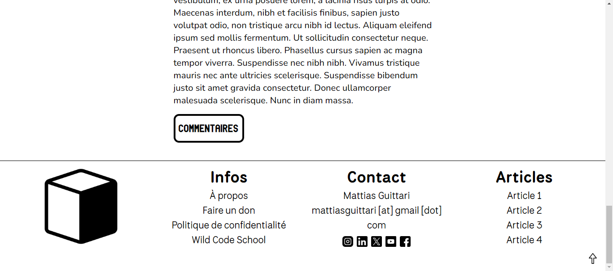
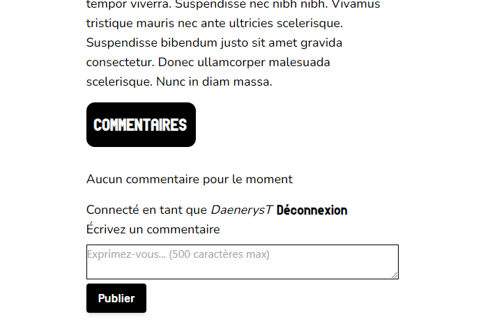
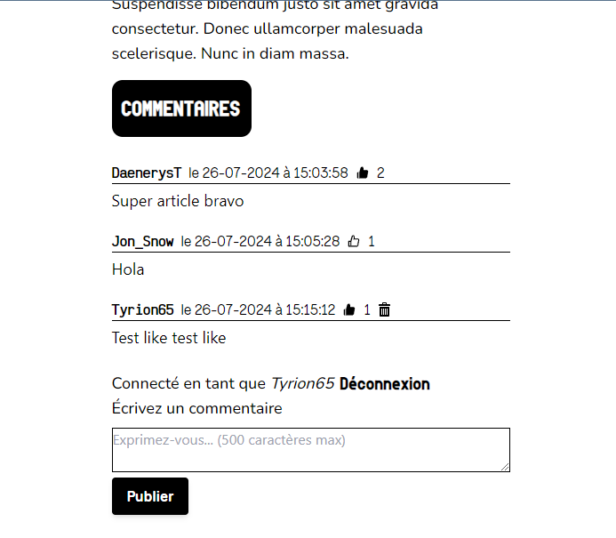
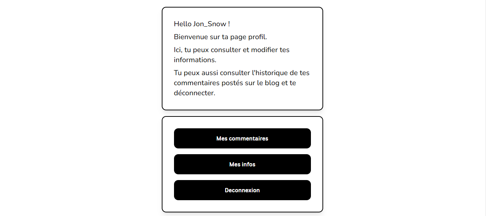
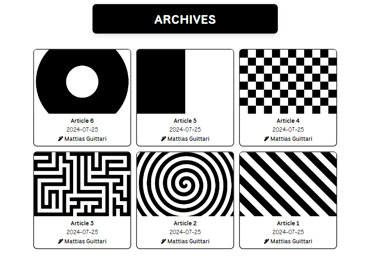

# Black and White Blog

Avec Noir et Blanc, j'ai voulu développer un site responsive de A à Z en y intégrant un maximum de fonctionnalités. Il s'agit d'un blog personnel de libre expression dans lequel il possible, pour un utilisateur, de lire des articles et d'y publier des commentaires. Pour cette dernière fonctionnalité, l'utilisateur doit passer par une inscription puis une authentification.

Inscription : hachage du mot de passe, impossibilité de choisir un pseudo/email déjà dans la base de données, mot de passe complexe exigé, pseudo doit respecter une certaine syntaxe (commencer par une lettre et interdiction de tous les caractères spéciaux sauf - et \_), message(s) d'erreur(s) dès qu'une contrainte n'est pas respectée

Connexion : message d'erreur si les données de connexion (email et mot de passe) ne sont pas valide, création d'un token jwt à la validation

L'utilisateur peut publier un commentaire sous un article s'il le souhaite. Pour que l'UX soit optimale, j'ai fait en sorte que les commentaires postés s'affichent en temps réel (grâce à un fetch déclenché au submit) sans que l'on ait besoin de rafraichir la page. Pareil pour la suppression. Il est également possible de liker/unliker un commentaire. Le problème que j'ai eu est que je n'ai pas réussi à gérer correctement l'état du bouton like (changement d'apparence) autrement qu'avec le localstorage. C'est fonctionnel sur un même et seul navigateur (je like, le bouton se remplit, j'unlike il se vide et si je me reconnecte plus tard l'état reste inchangé). La prochaine fois il faudra que je comprenne comment envoyer l'état dans la base de donnée. Ceci dit ça m'a permis de mieux comprendre comment marche le localstorage, donc c'est toujours ça de pris. EDIT : j'ai essayé pendant 2 jours de gérer l'état avec la base de données, sans succès, j'ai donc laissé le code avec le localstorage sauf que j'ai remarqué un nouveau problème : quand je me connecte ou déconnecte depuis l'espace commentaire, le state des boutons like ne se met pas à jour (par exemple, j'ai liké un commentaire : quand je me déconnecte le bouton ne devrait plus apparaitre rempli et inversement, si j'ai liké un commentaire au moment de la connexion il devrait apparaitre rempli... quand je rafraichit la page ça fonctionne mais ce n'est pas ce que je veux car ce n'est pas dynamique) et je n'ai pas trouvé de solution. Je laisse ça comme ça pour l'instant, j'y reviendrais plus tard.

Commentaires : incrémentation/décrémentation des likes dans la base de données, changement de couleur pour un commentaire liké (retour à l'état initial lors du unlike), impossibilité de supprimer le commentaire d'un autre utilisateur (masquage du bouton delete en css), formatage du texte (limite de caractères, effacement des blancs au submit, impossibilité de poster un commentaire vide), affichage de la mention "aucun commentaire pour le moment" si 0 commentaires postés, impossibilité de poster si non connecté, possibilité de se connecter/déconnecter et de s'inscrire directement depuis l'espace commentaire

J'ai créé un bouton random-article qui permet de naviguer sur un article au hasard quand on clique dessus. J'ai un peu galéré à concevoir ce bouton et d'ailleurs la solution que j'ai trouvée n'est peut-être pas idéale en terme de performance car les id des articles (récupérés pour choisir un nombre aléatoire) sont fetchés à chaque rendu du composant header, et non quand on clique sur le bouton, mais peut-être que c'est comme ça qu'on fait finalement.

Il est également possible pour un utilisateur via la page welcome de modifier son pseudo et son mot de passe (avec toujours les mêmes contraintes qu'à la création : contrainte de complexité de mot de passe et impossible de choisir un pseudo déjà utilisé, également : impossible de changer pour le même mot de passe). J'ai aussi fait attention à l'état des boutons après le submit (désactivation du bouton après une validation, bouton qui reste actif après un message d'erreur).

Pour conclure, il est possible que j'ai oublié des choses mais j'étais dans l'état d'esprit de vraiment penser à tout et de faire en sorte que l'expérience utilisateur soit vraiment aboutie. Deux choses pour finir : la fonctionnalité de fetch des commentaires par utilisateur (pour qu'un utilisateur ai accès à la liste de tous ses commentaires rangés par articles) n'est pas prête car je dois avancer sur d'autres projets et mon passage de diplome, il me manquait à coder ça pour que soit vraiment terminé tout ce que j'avais prévu, ça et un mode couleur inversées et bien sûr ce fichu bouton like... Enfin, et ça fera l'objet d'une deuxième phase de développement plus tard, c'est toute la partie administrateur, qui va permettre à l'auteur du blog de poster/modifier/supprimer ses articles, gérer les utilisateurs, modérer les commentaires. Je pense que j'utiliserais un CMS.

Merci de m'avoir lu, j'espère que c'était assez clair.

Mattias Guittari
